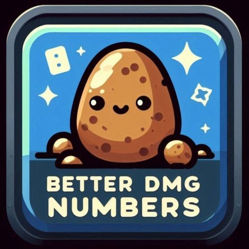
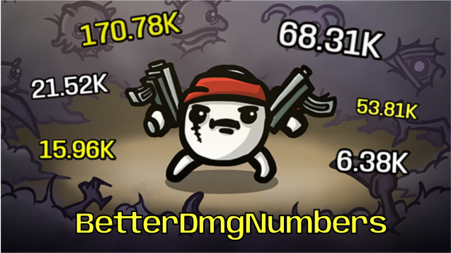

  

# BetterDmgNumbers

**Tired of squinting at your screen like you're deciphering ancient runes?** Say hello to BetterDmgNumbers, the Brotato Mod that gives your damage numbers a glow-up with *100% more readability!* (Trust me, I measured it.)

Get it now and give your eyeballs a break: [BetterDmgNumbers](https://steamcommunity.com/sharedfiles/filedetails/?id=3412963303)

  

## Planned Features
- Coming soon: Even your **item and weapon descriptions** will be *100% more readable*! Because why stop at just the damage numbers when we can sprinkle clarity *everywhere*? 🎉

## Got ideas?

Have a feature idea? Head over to the GitHub Issues tab and let me know!
